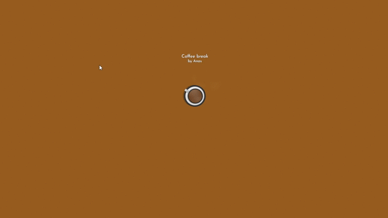

# CSS-Simmering-Coffee-Cup

Simple simmering cup of coffee placed on light-brown background.  
When mouse hovers over coffee, the cup rotates slightly (15 degrees)  
Use case: Banners for web-dev blogs

Updated: July 25, 2021

